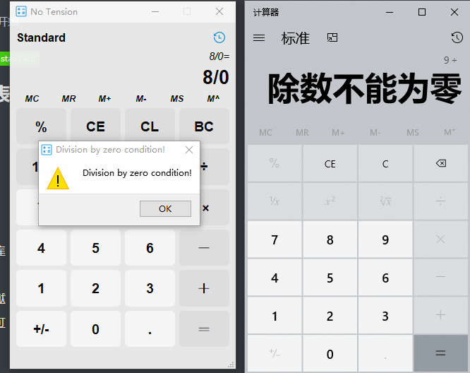
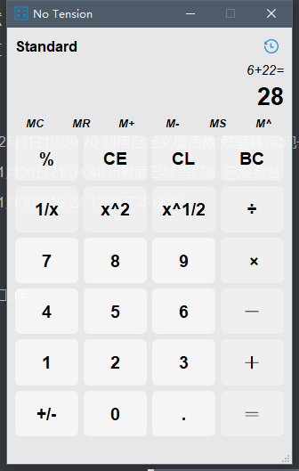
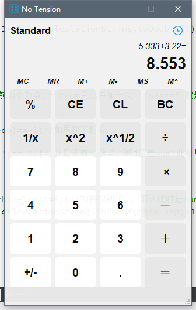
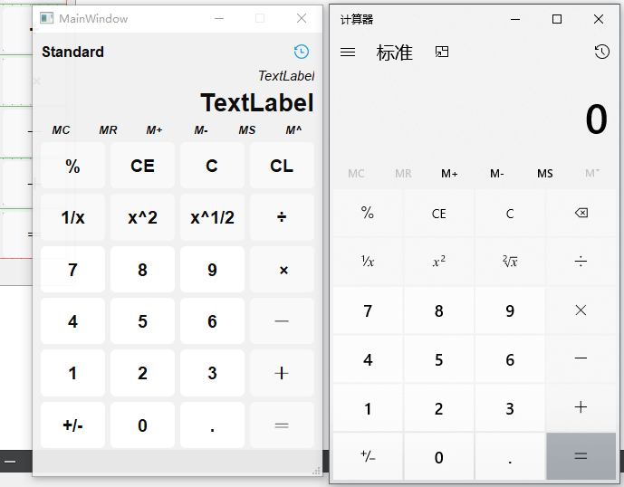

# Qt-Calculator
用qt做的一个仿Win计算器

我..再次从0开始

## 内容列表

- [更新](#更新)
- [目录](#目录)
- [背景](#背景)
- [安装](#安装)
- [示例](#示例)
- [相关仓库](#相关仓库)
- [维护者](#维护者)
- [如何贡献](#如何贡献)
- [使用许可](#使用许可)

## 更新

- 2020年12月3日13:26:24 添加动画 历史记录搞定了 剩下的可能是视觉方面的优化
- 2020年12月2日23:56:11 历史记录搞到一半,算了,先睡觉
- 2020年12月2日19:48:46 优化一些基本内容
- 2020年12月2日19:18:41 基本完成所有功能 除了历史功能
- 2020年12月2日19:17:11 支持平方,倒数,取余 对除0异常使用catch,优化了结构,详细看[示例](#示例)
- 2020年12月2日14:36:19 支持退格以及开方
- 2020年12月2日14:36:04 修复很多bug
- 2020年12月1日23:51:07 支持clean 以及优化了一下结构
- 2020年12月1日23:19:42 支持加上小数点
- 2020年12月1日22:56:11 支持正负号实现
- 2020年12月1日22:50:15 修改了一些小bug
- 2020年12月1日21:31:23 已实现加减乘除
- 2020年12月1日10:39:20 利用自定义槽函数(勉强算)实现一般加法
- 2020年11月30日21:04:40 ui界面已经写好啦,还没命名
- 2020年11月30日19:24:12 有了本仓库

## 背景

- 想找qt的工作 

## 安装

暂无

## 示例

## 相关仓库

## 维护者

[@yujiecong](https://github.com/yujiecong)。

## 如何贡献

非常欢迎你的加入！[提一个 Issue](./issues/new) 或者提交一个 Pull Request。

本 Readme 遵循 [Contributor Covenant](http://contributor-covenant.org/version/1/3/0/) 行为规范。

### 贡献者

感谢以下参与项目的人：  

## 使用许可

[MIT License](./blob/master/LICENSE)